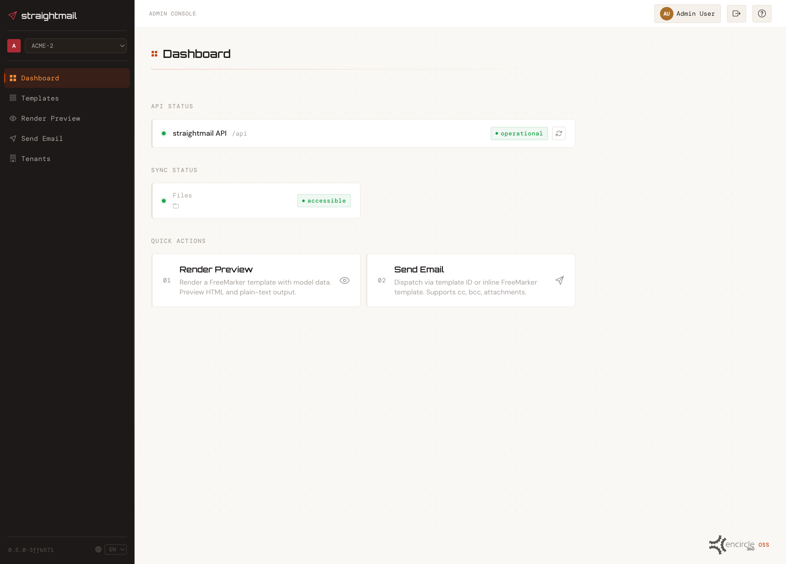
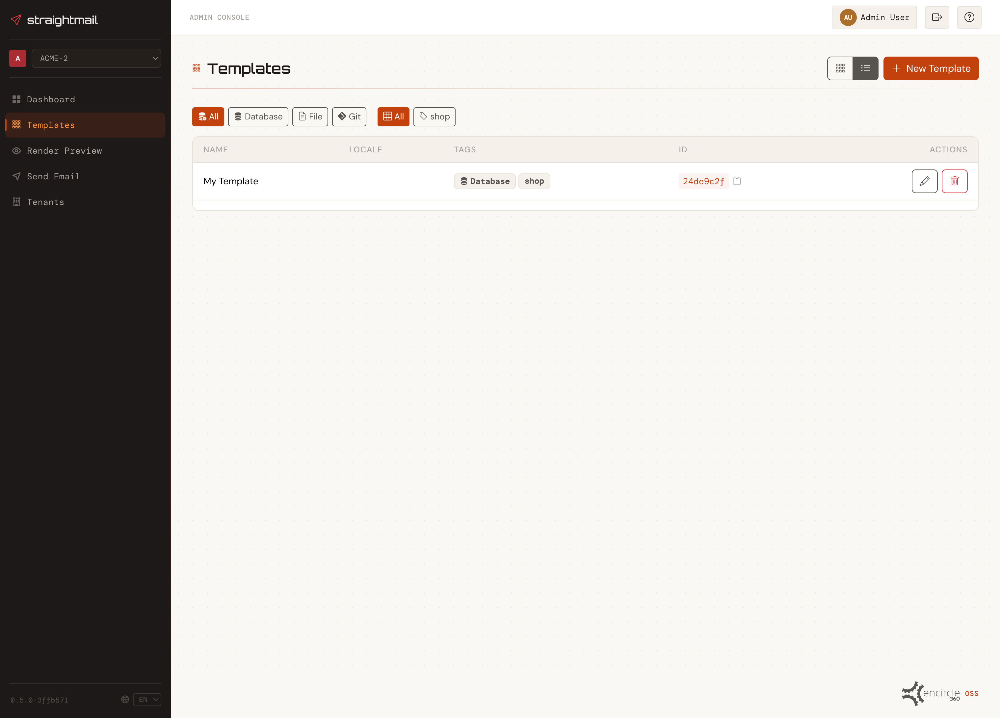
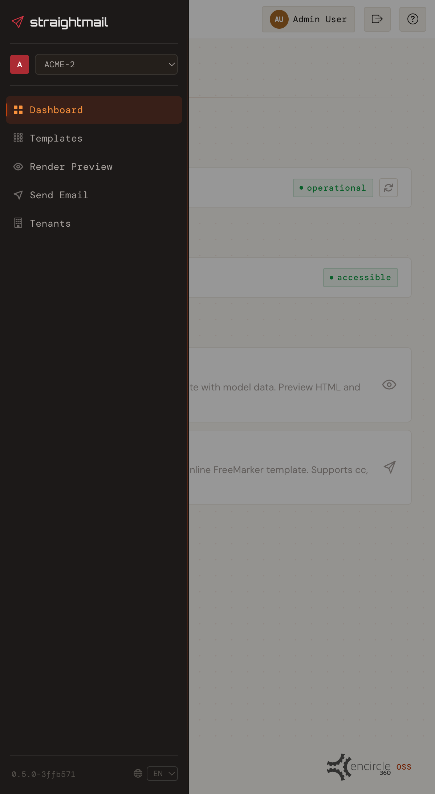
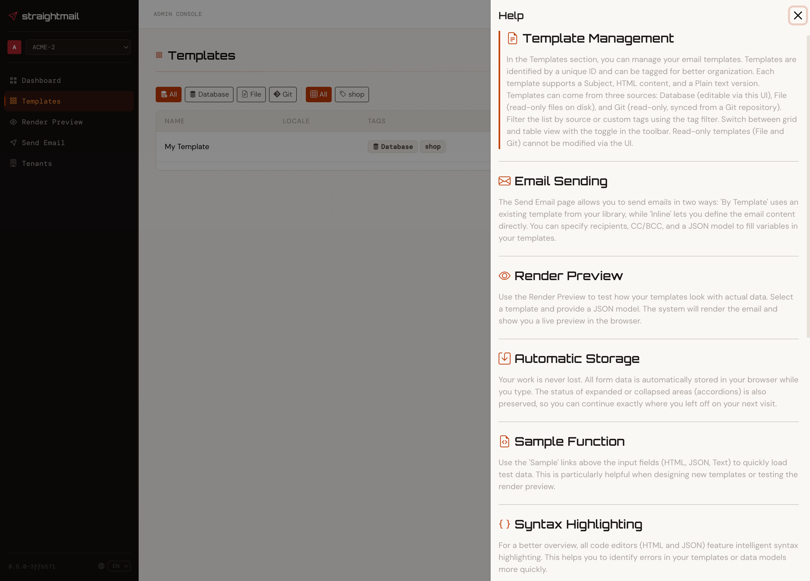
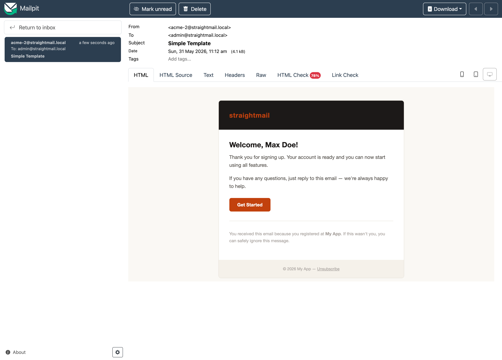

# StraightMail Admin Console

[](https://github.com/encircle360-oss/straightmail-admin/actions)
[](LICENSE)
[](https://angular.io/)
[](https://www.typescriptlang.org/)
[](https://www.npmjs.com/)

A modern, open-source Angular administration console for managing email templates, rendering, and sending operations with the StraightMail email service.



<table width="800">
  <tr>
    <td valign="top" width="25%" align="center">
      
      <br><sub>Templates</sub>
    </td>
    <td valign="top" width="25%" align="center">
      
      <br><sub>Edit Template</sub>
    </td>
    <td valign="top" width="25%" align="center">
      
      <br><sub>Render Preview</sub>
    </td>
    <td valign="top" width="25%" rowspan="2" align="center" valign="top">
      
      <br><sub>Mobile View</sub>
    </td>
  </tr>
  <tr>
    <td valign="top" width="25%" align="center">
      
      <br><sub>Send Mail</sub>
    </td>
    <td valign="top" width="25%" align="center">
      
      <br><sub>Help Panel</sub>
    </td>
    <td valign="top" width="25%" align="center">
      
      <br><sub>Mail Output</sub>
    </td>
  </tr>
</table>

> ⚠️ **Alpha Stage Notice**: This project is currently in alpha stage and under active development. Features may be incomplete, and breaking changes may occur. Use in production environments at your own risk.

## ✨ Features

- 📧 **Email Template Management** - Create, edit, and delete email templates with HTML and plain text support, tag filtering, and pagination
- 🎨 **Template Rendering** - Preview rendered email templates with dynamic FreeMarker variable substitution (HTML + plain text)
- 📤 **Email Sending** - Send emails by template ID or inline template with dynamic recipients, CC/BCC, locale, and JSON model
- 🔐 **OIDC Authentication** - Configurable OpenID Connect authentication (e.g. Keycloak) with silent token renewal and Bearer token injection
- 📊 **API Health Dashboard** - Real-time API status monitoring with quick-action shortcuts
- 🌐 **Internationalization** - Full i18n support for English and German via ngx-translate
- 💾 **Persistent State** - Form inputs and application state persisted to localStorage via NGXS storage plugin
- 🎯 **Modern UI** - Responsive interface built with Bootstrap 5, ng-bootstrap, and custom Bootstrap Icons
- 🔧 **Developer Tools** - NGXS DevTools and logger plugins for easier debugging

## 🚀 Quick Start

### Prerequisites

- Node.js (v18 or higher recommended)
- npm 11.8.0 or higher
- Angular CLI 21.2 or higher
- A running [StraightMail](https://github.com/encircle360-oss/straightmail) backend (default: `http://localhost:50003`)

### Installation

```bash
# Clone the repository
git clone https://github.com/encircle360-oss/straightmail-admin.git
cd straightmail-admin

# Install dependencies
npm install

# Start the development server
npm start
```

The application will be available at `http://localhost:4200/`.

By default, authentication is **disabled** in development mode so you can start immediately without configuring an OIDC provider.

## 📦 Available Scripts

| Command         | Description                         |
|-----------------|-------------------------------------|
| `npm start`     | Start development server            |
| `npm run build` | Build the project for production    |
| `npm run watch` | Build in watch mode for development |
| `npm test`      | Run unit tests with Vitest          |
| `npm run ng`    | Run Angular CLI commands            |

## 🏗️ Project Structure

```
straightmail-admin/
├── src/
│   ├── app/
│   │   ├── core/
│   │   │   ├── guards/        # Auth route guard
│   │   │   ├── interceptors/  # Bearer token HTTP interceptor
│   │   │   └── services/      # Auth service, API service
│   │   ├── layout/            # Main shell (sidebar + topbar)
│   │   ├── pages/
│   │   │   ├── dashboard/     # API health check & quick actions
│   │   │   ├── send/          # Email sending (by ID or inline)
│   │   │   ├── render/        # Template rendering preview
│   │   │   └── templates/     # Template CRUD management
│   │   ├── shared/            # Toast notification component
│   │   └── store/
│   │       ├── auth/          # Auth NGXS state
│   │       ├── send/          # Send form NGXS state
│   │       ├── render/        # Render form NGXS state
│   │       ├── templates/     # Templates NGXS state
│   │       └── toast/         # Toast NGXS state
│   ├── environments/
│   │   ├── environment.ts     # Development configuration
│   │   └── environment.prod.ts # Production configuration
│   ├── index.html
│   ├── main.ts
│   └── styles.scss
└── public/
    ├── assets/i18n/           # Translation files (en.json, de.json)
    └── logos/                 # Brand assets
```

## 🛠️ Tech Stack

| Category                 | Technology                                         |
|--------------------------|----------------------------------------------------|
| **Framework**            | Angular 21.2                                       |
| **State Management**     | NGXS 21.0 (with devtools, logger, storage plugins) |
| **UI Library**           | Bootstrap 5.3 with ng-bootstrap                    |
| **Icons**                | Bootstrap Icons 1.13                               |
| **Internationalization** | ngx-translate 17.0                                 |
| **Authentication**       | angular-auth-oidc-client 21.0                      |
| **Language**             | TypeScript 5.9 (strict mode)                       |
| **Build Tool**           | Angular CLI with esbuild                           |
| **Testing**              | Vitest 4.0 with jsdom                              |

## 🗄️ State Management

NGXS stores follow a **CQRS-inspired Command/Event pattern**:

- **Commands** express *intent* (e.g. `CreateTemplate`, `SendByTemplate`) and are dispatched by components
- **Events** report *outcome* (e.g. `CreateTemplateSuccess`, `SendFailed`) and are dispatched by the state handler after the API call completes

```
Component  →  dispatch(Command)
                 ↓
           State handler → API call
                              ↓ tap / catchError
                          dispatch([SuccessEvent | FailedEvent, ShowToast])
```

### Listening to events in components

Components must listen to **events**, not commands:

```typescript
// Correct — decoupled from state implementation
this.actions$.pipe(
  ofActionDispatched(TemplatesActions.CreateTemplateSuccess, TemplatesActions.UpdateTemplateSuccess),
  take(1),
).subscribe(() => this.router.navigate(['/templates']));

// Incorrect — couples component to command lifecycle
ofActionSuccessful(TemplatesActions.CreateTemplate)
```

### Available events per store

| Store       | Success events                                                                                    | Failure event         |
|-------------|---------------------------------------------------------------------------------------------------|-----------------------|
| `templates` | `CreateTemplateSuccess(template)`, `UpdateTemplateSuccess(template)`, `DeleteTemplateSuccess(id)` | `*Failed(error)`      |
| `send`      | `SendByTemplateSuccess`, `SendInlineSuccess`                                                      | `SendFailed(error)`   |
| `render`    | `RenderSuccess(result)`                                                                           | `RenderFailed(error)` |

All events are defined alongside their commands in the respective `*.actions.ts` file under `src/app/pages/*/store/`.

## 🔐 Authentication (OIDC)

The admin console supports OpenID Connect (OIDC) authentication, tested with **Keycloak**. Authentication is **optional** and can be toggled per environment.

### How it works

- On startup, `checkAuth()` is called via `APP_INITIALIZER` to restore an existing session
- An **auth guard** protects all routes and redirects unauthenticated users to the OIDC provider
- An **HTTP interceptor** automatically attaches `Authorization: Bearer <token>` to all API requests
- **Silent token renewal** is enabled using refresh tokens
- Auth state (user info, token) is persisted to `localStorage` via the NGXS storage plugin

### Configuration

Authentication is configured in the environment files:

**`src/environments/environment.ts`** (development — auth disabled by default):

```typescript
export const environment = {
  production: false,
  authEnabled: false,          // Set to true to enable OIDC in dev
  API: 'http://localhost:50003',
  oidc: {
    authority: 'https://your-keycloak-host/realms/your-realm',
    clientId: 'straightmail',
    scope: 'openid profile email',
    responseType: 'code',
    silentRenew: true,
    useRefreshToken: true,
    renewTimeBeforeTokenExpiresInSeconds: 30,
  }
};
```

**`src/environments/environment.prod.ts`** (production — auth enabled):

```typescript
export const environment = {
  production: true,
  authEnabled: true,           // Auth enforced in production
  API: 'http://localhost:50003',
  oidc: { /* same as above */}
};
```

### Keycloak Setup

1. Create a realm and a client with ID `straightmail`
2. Set **Valid redirect URIs** to your app's origin (e.g. `http://localhost:4200/*`)
3. Enable **Standard flow** and **Refresh token** support
4. Set `authority` in `environment.ts` to your realm URL

When `authEnabled: false`, no OIDC providers or interceptors are registered, allowing the app to run without any authentication backend.

## 🔌 API Integration

The admin console integrates with the StraightMail backend API.

**Default base URL**: `http://localhost:50003`

| Method   | Endpoint          | Description                                     |
|----------|-------------------|-------------------------------------------------|
| `GET`    | `/info`           | API health check                                |
| `GET`    | `/templates`      | List templates (paginated, optional tag filter) |
| `POST`   | `/templates`      | Create a new template                           |
| `PUT`    | `/templates/{id}` | Update an existing template                     |
| `DELETE` | `/templates/{id}` | Delete a template                               |
| `POST`   | `/email`          | Send email by template ID                       |
| `POST`   | `/email/inline`   | Send email with inline template                 |
| `POST`   | `/render`         | Render a template and return HTML/plain text    |

Configure the API base URL in `src/environments/environment.ts`.

## 📄 Pages

### Dashboard

Displays the current API connection status (checking / up / down) and provides quick-action cards to navigate to Send and Render pages.

### Email Sending (`/send`)

Two send modes selectable via tabs:

- **By Template ID**: Select a stored template, optionally override the subject, and provide recipients and a JSON data model
- **Inline**: Provide a raw HTML/FreeMarker template directly in the form

Both modes support: multiple recipients, CC, BCC, locale selection (en, de, fr, es, it, pt), and a JSON model for variable substitution. Form state is persisted across page reloads.

### Template Rendering (`/render`)

Render a template by ID with a JSON model and preview the output in a modal with separate tabs for HTML (live preview) and plain text.

### Template Management (`/templates`)

Full CRUD interface for email templates with:

- Paginated list (20 per page)
- Filter by tag
- Create / edit via modal dialog
- Delete & exit edit view with confirmation
- Fields: name, locale, tags, subject, HTML body, plain text body

## 🧪 Testing

```bash
npm test
```

Tests are written using Vitest with jsdom for DOM manipulation testing.

## 📝 Building for Production

```bash
npm run build
```

The production build will be output to the `dist/` directory with:

- Output hashing for cache busting
- Bundle size budgets (max 1MB initial, 8kB component styles)
- License extraction
- OIDC authentication enabled

## 🤝 Contributing

Contributions are welcome! Please feel free to submit a Pull Request.

1. Fork the repository
2. Create your feature branch (`git checkout -b feature/amazing-feature`)
3. Commit your changes (`git commit -m '✨ feat: add amazing feature'`)
4. Push to the branch (`git push origin feature/amazing-feature`)
5. Open a Pull Request

## 📄 License

This project is licensed under the MIT License - see the [LICENSE](LICENSE) file for details.

## 🙏 Acknowledgments

- Built with [Angular](https://angular.io/)
- State management by [NGXS](https://www.ngxs.io/)
- UI components from [ng-bootstrap](https://ng-bootstrap.github.io/)
- OIDC via [angular-auth-oidc-client](https://github.com/damienbod/angular-auth-oidc-client)

## 📧 Support

For issues and questions, please use the [GitHub Issues](https://github.com/encircle360-oss/straightmail-admin/issues) page.

---

Made with ❤️ by encircle360 OSS
